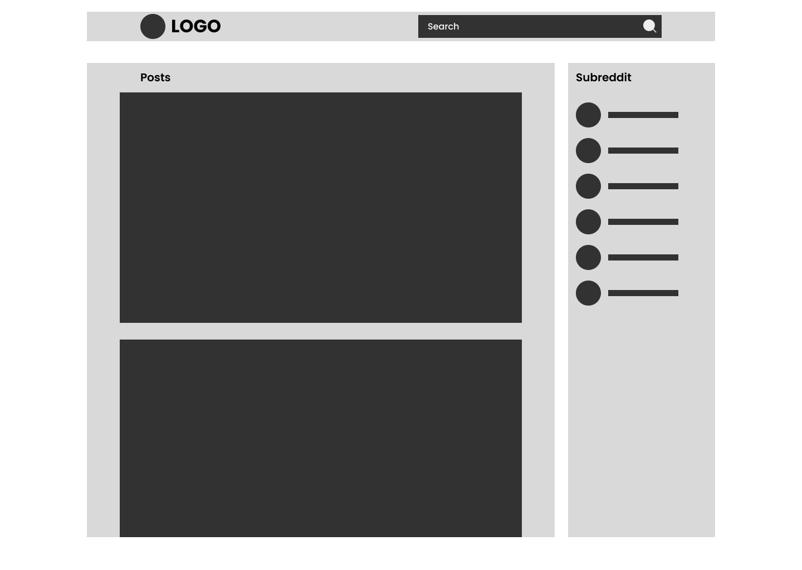
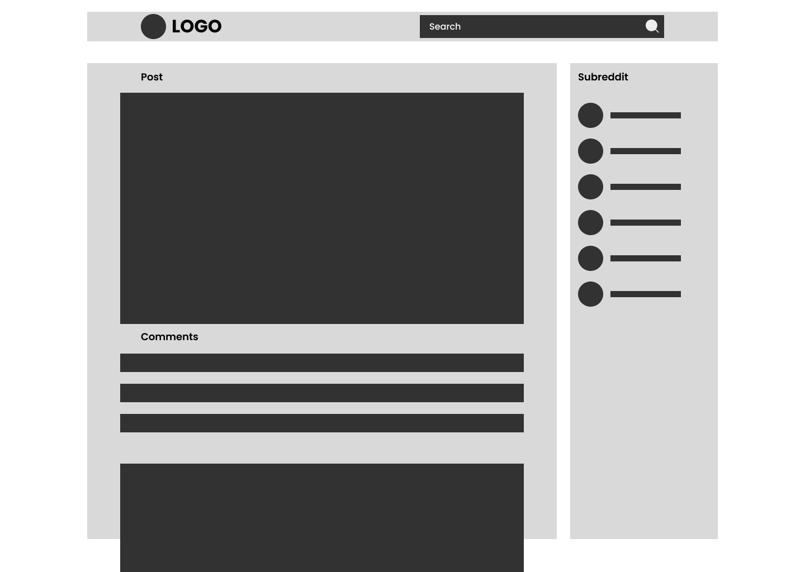
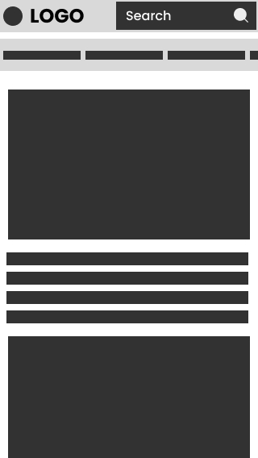

# [Small Reddit](https://small-reddit.vercel.app/)

Small Reddit is a simplified Reddit clone that allows users to view posts, search for specific subreddits, and load comments. The app is built using React and Redux and utilizes the Reddit API to fetch posts and display them. [Live preview](https://small-reddit.vercel.app/)

## Table of Contents
- [Small Reddit](#small-reddit)
  - [Table of Contents](#table-of-contents)
  - [Wireframes](#wireframes)
  - [Technologies Used](#technologies-used)
  - [Features](#features)
  - [Future Work](#future-work)
  - [Installation](#installation)
  - [Usage](#usage)
  - [Contributing](#contributing)
  - [License](#license)

## Wireframes

Below are the wireframes designed for Small Reddit. They illustrate the basic layout and design of the application.

| Desktop Overview                                         | Desktop Comments Section                                            |
|----------------------------------------------------------|---------------------------------------------------------------------|
|  |  |

|  Mobile Overview                                         | Mobile Comments Section                                             |
|----------------------------------------------------------|---------------------------------------------------------------------|
|   |   |

## Technologies Used

The following technologies were used in this project:

- **React**: A JavaScript library for building user interfaces.
- **Redux**: State management library to handle global state and data fetching.
- **Tailwind CSS**: A utility-first CSS framework used for styling and creating responsive designs.
- **Reddit API**: Used to fetch posts and comments.
- **PropTypes**: For type checking React props.

## Features

- **Post Viewing**: Browse a list of posts fetched from Reddit's API.
- **Search Subreddits**: Allows users to search for subreddits by name.
- **Comment Section**: Toggle the visibility of comments for each post and load comments dynamically.
- **Loading Skeletons**: Displays loading skeletons while data is being fetched to improve user experience.
- **Responsive Design**: The application is fully responsive and works on all screen sizes.

## Future Work

The following improvements and features are planned for future development:

- **Authentication**: Allow users to log in with their Reddit accounts and interact with posts (upvote/downvote).
- **Infinite Scroll**: Implement infinite scroll to dynamically load more posts as users scroll down the page.
- **Post Creation**: Enable users to create their own posts.
- **Dark Mode/Light Mode**: Add a toggle for dark & light mode to enhance the user experience.

## Installation

To run the projects locally, follow these steps:

1. Clone the repository:
    ```bash
    git clone https://github.com/Medo-ID/Small-Reddit.git

2. Install the necessary dependencies:
   ```bash
    npm install

3. Start the development server:
    ```bash
    npm run dev

## Usage

After starting the development server, open the application in your browser at http://localhost:****. You can browse posts, search for subreddits, and toggle comments for each post.

## Contributing

Contributions are welcome! If you have any suggestions or improvements, please create a pull request or open an issue in the GitHub repository.

## License
This project is licensed under the MIT License. See the License file for more details.